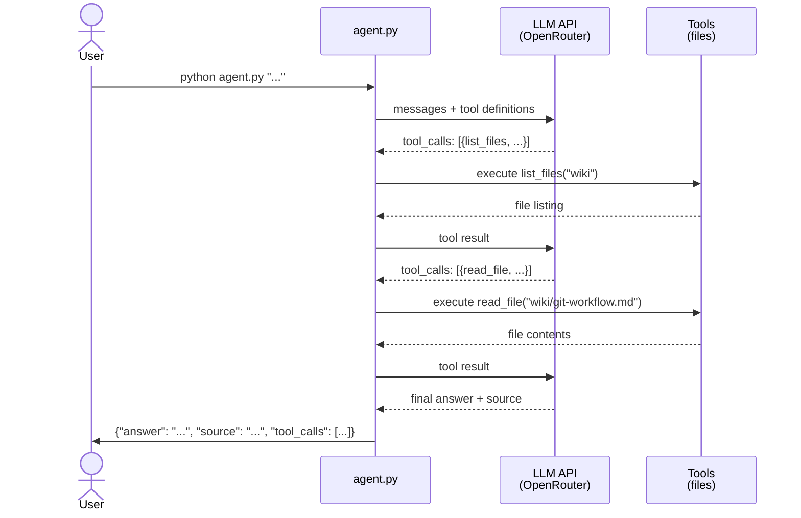

# The Documentation Agent

<h4>Time</h4>

~120 min

<h4>Purpose</h4>

Build an agent that answers questions by navigating the project wiki — learning the agentic loop, tool calling, and CLI design in the process.

<h4>Context</h4>

An **agent** is a program that uses an LLM with **tools** — functions it can call to interact with the real world. Unlike a chatbot that answers from training data alone, an agent can read files, query APIs, and reason about real information. The difference is the **agentic loop**: the LLM decides which tool to call, your code executes it, feeds the result back, and the LLM decides what to do next — call another tool or give the final answer.

In this task you will build a CLI agent that reads the project wiki, finds the section that answers a question, and returns both the answer and the source reference.

<h4>Diagram</h4>



<h4>Table of contents</h4>

- [1. Steps](#1-steps)
  - [1.1. Follow the `Git workflow`](#11-follow-the-git-workflow)
  - [1.2. Create a `Lab Task` issue](#12-create-a-lab-task-issue)
  - [1.3. Write a plan](#13-write-a-plan)
  - [1.4. Set up the LLM connection](#14-set-up-the-llm-connection)
  - [1.5. Build the agent](#15-build-the-agent)
    - [1.5.1. Create the CLI entry point](#151-create-the-cli-entry-point)
    - [1.5.2. Add tool definitions](#152-add-tool-definitions)
    - [1.5.3. Implement the tools](#153-implement-the-tools)
    - [1.5.4. Implement the agentic loop](#154-implement-the-agentic-loop)
  - [1.6. Test with the benchmark](#16-test-with-the-benchmark)
  - [1.7. Write documentation](#17-write-documentation)
  - [1.8. Write regression tests](#18-write-regression-tests)
  - [1.9. Deploy to your VM](#19-deploy-to-your-vm)
  - [1.10. Finish the task](#110-finish-the-task)
  - [1.11. Check the task using the autochecker](#111-check-the-task-using-the-autochecker)
- [2. Acceptance criteria](#2-acceptance-criteria)

## 1. Steps

### 1.1. Follow the `Git workflow`

Follow the [`Git workflow`](../../../wiki/git-workflow.md) to complete this task.

### 1.2. Create a `Lab Task` issue

Title: `[Task] The Documentation Agent`

### 1.3. Write a plan

Before writing code, create `plans/task-1.md`. Describe:

- Which LLM provider and model you will use, and why.
- How you will structure the agent (argument parsing, LLM call, output formatting).
- How you will implement the tools (`read_file`, `list_files`) and the agentic loop.
- What your system prompt strategy will be (how will the LLM know to look in the wiki?).

Commit:

```text
docs: add implementation plan for documentation agent
```

### 1.4. Set up the LLM connection

Your agent needs an LLM that supports the OpenAI-compatible chat completions API with **tool calling** (also called function calling).

1. If you haven't already, set up your LLM credentials during [lab setup](../setup-simple.md#19-set-up-llm-access).

2. Verify your LLM connection supports tool calling:

   ```terminal
   python verify_llm.py
   ```

   You should see:

   ```terminal
   ✓ LLM connection works
   ✓ Tool calling works
   ```

   > [!NOTE]
   > If the verification fails, check your `.env.agent.secret` configuration. Make sure `LLM_API_KEY`, `LLM_API_BASE`, and `LLM_MODEL` are set correctly. See the [recommended models](../setup-simple.md#19-set-up-llm-access) for models that support tool calling.

### 1.5. Build the agent

- [1.5.1. Create the CLI entry point](#151-create-the-cli-entry-point)
- [1.5.2. Add tool definitions](#152-add-tool-definitions)
- [1.5.3. Implement the tools](#153-implement-the-tools)
- [1.5.4. Implement the agentic loop](#154-implement-the-agentic-loop)

#### 1.5.1. Create the CLI entry point

Create `agent.py` in the project root. The agent takes a question as a command-line argument and outputs `JSON` to stdout.

**Input:**

```terminal
python agent.py "How do you resolve a merge conflict?"
```

**Output:**

```json
{
  "answer": "Edit the conflicting file, choose which changes to keep, then stage and commit.",
  "source": "wiki/git-workflow.md#resolving-merge-conflicts",
  "tool_calls": [
    {"tool": "list_files", "args": {"path": "wiki"}, "result": "git-workflow.md\n..."},
    {"tool": "read_file", "args": {"path": "wiki/git-workflow.md"}, "result": "..."}
  ]
}
```

**Output fields:**

- `answer` (string, required) — the agent's answer to the question.
- `source` (string, required) — the wiki section reference (e.g., `wiki/git-workflow.md#resolving-merge-conflicts`).
- `tool_calls` (array, required) — all tool calls made. Each entry has `tool`, `args`, and `result`.

**Rules:**

- Only valid `JSON` goes to stdout. All debug/progress output goes to stderr.
- The agent must respond within 60 seconds.
- Maximum 10 tool calls per question.
- Exit code 0 on success.

#### 1.5.2. Add tool definitions

Define your tools as `JSON` schemas in the `tools` parameter of your LLM API request. The LLM uses these schemas to decide which tool to call.

You need two tools for this task:

**`read_file`** — Read a file from the project repository.

- **Parameters:** `path` (string) — relative path from project root.
- **Returns:** file contents as a string, or an error message if the file doesn't exist.
- **Security:** must not read files outside the project directory (no `../` traversal).

**`list_files`** — List files and directories at a given path.

- **Parameters:** `path` (string) — relative directory path from project root.
- **Returns:** newline-separated listing of entries.
- **Security:** must not list directories outside the project directory.

#### 1.5.3. Implement the tools

Implement the `Python` functions that execute when the LLM calls a tool. Each function:

1. Receives the arguments from the LLM's tool call.
2. Validates the path is within the project directory (security).
3. Performs the operation (reads file or lists directory).
4. Returns the result as a string.

> [!NOTE]
> **Path security:** Resolve the path and check it starts with the project root. This prevents the LLM from requesting `../../etc/passwd` or similar paths outside your project.

#### 1.5.4. Implement the agentic loop

The agentic loop is the core of your agent:

1. Send the user's question + tool definitions to the LLM.
2. If the LLM responds with `tool_calls` → execute each tool, append results as tool role messages, go to step 1.
3. If the LLM responds with a text message (no tool calls) → that's the final answer. Extract the answer and source, output `JSON`, and exit.
4. If you hit 10 tool calls → stop looping, use whatever answer you have.

Your system prompt should tell the LLM:

- It is a documentation agent that answers questions using the project wiki.
- It should use `list_files` to discover wiki files, then `read_file` to find the answer.
- It must include the source reference (file path + section anchor) in its response.

Commit:

```text
feat: implement documentation agent with wiki tools
```

### 1.6. Test with the benchmark

Run the evaluation benchmark to test your agent against wiki questions:

```terminal
python run_eval.py
```

The benchmark fetches questions one at a time, runs your agent, and checks the answer. It stops at the first failure.

```
  ✓ [1/15] How do you resolve a merge conflict?
  ✓ [2/15] What is a Docker volume used for?
  ✗ [3/15] What HTTP methods does REST use?
    feedback: Check wiki/rest-api.md for the section on HTTP methods.

2/15 passed
```

Fix the failing question, then re-run. Iterate until all Task 1 questions pass.

> [!NOTE]
> Common fixes: improve the system prompt so the LLM looks in the right wiki file, fix tool implementations for edge cases, improve tool descriptions so the LLM understands when to use each tool.

### 1.7. Write documentation

Create `AGENT.md` in the project root documenting:

- **Architecture**: how the agent works (input parsing, agentic loop, output formatting).
- **LLM provider**: which provider and model you chose, and why.
- **Tools**: what each tool does, its parameters, and security constraints.
- **System prompt strategy**: how you guide the LLM to navigate the wiki.
- **How to run**: the command and required environment variables.

Commit:

```text
docs: add agent architecture documentation
```

### 1.8. Write regression tests

Create 5 regression tests that verify your agent works. Each test should:

1. Run `agent.py` as a subprocess with a known question.
2. Parse the stdout `JSON`.
3. Check that `answer`, `source`, and `tool_calls` are present.
4. Check that `tool_calls` is non-empty and contains the expected tool name.
5. Check that the `source` field points to a reasonable wiki section.

Example test questions:

- `"How do you resolve a merge conflict?"` → expects `read_file` in tool_calls, `wiki/git-workflow.md` in source.
- `"What files are in the wiki?"` → expects `list_files` in tool_calls.
- `"What is a Docker volume?"` → expects `read_file` in tool_calls, `wiki/docker` in source.

Commit:

```text
test: add regression tests for documentation agent
```

### 1.9. Deploy to your VM

Deploy the updated agent to your VM. The autochecker will `SSH` in and run questions that require tools.

1. Push your branch to your fork.
2. On the VM, pull the latest code:

   ```terminal
   cd ~/se-toolkit-lab-6
   git pull
   ```

3. Make sure `.env.agent.secret` is configured on the VM (same values as your local setup).

4. Verify the agent works on the VM:

   ```terminal
   python agent.py "What is a Docker volume?"
   ```

   You should see valid `JSON` output with `answer`, `source`, and `tool_calls` fields.

### 1.10. Finish the task

1. [Create a PR](../../../wiki/git-workflow.md#create-a-pr) with your changes.
2. [Get a PR review](../../../wiki/git-workflow.md#get-a-pr-review) and complete the subsequent steps in the `Git workflow`.

### 1.11. Check the task using the autochecker

[Check the task using the autochecker `Telegram` bot](../../../wiki/autochecker.md#check-the-task-using-the-autochecker-bot).

---

## 2. Acceptance criteria

- [ ] Issue has the correct title.
- [ ] `plans/task-1.md` exists with the implementation plan (committed before code).
- [ ] `agent.py` exists in the project root.
- [ ] `python agent.py "..."` outputs valid `JSON` with `answer`, `source`, and `tool_calls`.
- [ ] The agent uses `read_file` and `list_files` tools to navigate the wiki.
- [ ] The `source` field correctly identifies the wiki section that answers the question.
- [ ] Tools do not access files outside the project directory.
- [ ] `AGENT.md` documents the agent architecture.
- [ ] 5 regression tests exist and pass.
- [ ] The agent works on the VM via `SSH`.
- [ ] The benchmark passes all Task 1 questions locally.
- [ ] PR is approved and merged.
- [ ] Issue is closed by the PR.
