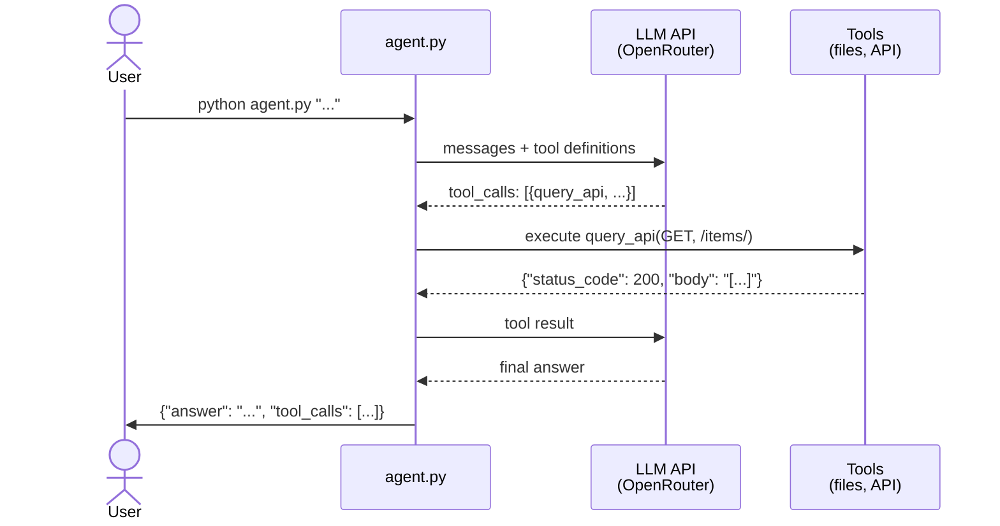

# The System Agent

<h4>Time</h4>

~90 min

<h4>Purpose</h4>

Connect the agent to your live system so it can query the API and answer questions about the actual deployment.

<h4>Context</h4>

In Task 1 you built an agent that reads documentation. But documentation can be outdated — the real system is the source of truth. In this task you will give your agent a new tool (`query_api`) so it can talk to your deployed backend, and teach it to answer two new kinds of questions: static system facts (framework, ports, status codes) and data-dependent queries (item count, scores).

<h4>Diagram</h4>



<h4>Table of contents</h4>

- [1. Steps](#1-steps)
  - [1.1. Follow the `Git workflow`](#11-follow-the-git-workflow)
  - [1.2. Create a `Lab Task` issue](#12-create-a-lab-task-issue)
  - [1.3. Write a plan](#13-write-a-plan)
  - [1.4. Add the `query_api` tool](#14-add-the-query_api-tool)
    - [1.4.1. Define the tool schema](#141-define-the-tool-schema)
    - [1.4.2. Implement the tool](#142-implement-the-tool)
  - [1.5. Update the system prompt](#15-update-the-system-prompt)
  - [1.6. Test with the benchmark](#16-test-with-the-benchmark)
  - [1.7. Update documentation](#17-update-documentation)
  - [1.8. Write regression tests](#18-write-regression-tests)
  - [1.9. Deploy to your VM](#19-deploy-to-your-vm)
  - [1.10. Finish the task](#110-finish-the-task)
  - [1.11. Check the task using the autochecker](#111-check-the-task-using-the-autochecker)
- [2. Acceptance criteria](#2-acceptance-criteria)

## 1. Steps

### 1.1. Follow the `Git workflow`

Follow the [`Git workflow`](../../../wiki/git-workflow.md) to complete this task.

### 1.2. Create a `Lab Task` issue

Title: `[Task] The System Agent`

### 1.3. Write a plan

Before writing code, create `plans/task-2.md`. Describe:

- How you will define the `query_api` tool schema.
- How you will handle authentication (`LMS_API_KEY`).
- How you will update the system prompt so the LLM knows when to use wiki tools vs the API tool.

Commit:

```text
docs: add implementation plan for system agent
```

### 1.4. Add the `query_api` tool

- [1.4.1. Define the tool schema](#141-define-the-tool-schema)
- [1.4.2. Implement the tool](#142-implement-the-tool)

#### 1.4.1. Define the tool schema

Add `query_api` to your tool definitions in the LLM API request.

**`query_api`** — Call the deployed backend API.

- **Parameters:**
  - `method` (string) — HTTP method (GET, POST, etc.).
  - `path` (string) — API path (e.g., `/items/`).
  - `body` (string, optional) — `JSON` request body.
- **Returns:** `JSON` string with `status_code` and `body`.

#### 1.4.2. Implement the tool

Implement the `query_api` function. It should:

1. Read `LMS_API_KEY` from `.env.docker.secret`.
2. Make an HTTP request to the backend at `http://localhost:42002` (or a configurable base URL).
3. Include the `Authorization: Bearer <LMS_API_KEY>` header.
4. Return the response as `JSON` with `status_code` and `body` fields.

> [!NOTE]
> **Two distinct keys:** `LMS_API_KEY` (in `.env.docker.secret`) protects your backend endpoints. `LLM_API_KEY` (in `.env.agent.secret`) authenticates with your LLM provider. Don't mix them up.

Commit:

```text
feat: add query_api tool for system queries
```

### 1.5. Update the system prompt

Update your system prompt so the LLM knows:

- When to use wiki tools (questions about course concepts, documentation).
- When to use `query_api` (questions about the running system, live data, status codes).
- When to use `read_file` on source code (questions about implementation details like which framework, ORM, etc.).

### 1.6. Test with the benchmark

Run the benchmark again. It now includes system questions in addition to wiki questions:

```terminal
python run_eval.py
```

New question types you will see:

- **Static system facts:** "What framework does the backend use?" — the answer is in the source code and never changes.
- **Data-dependent queries:** "How many items are in the database?" — the answer depends on your data.

When a question fails, the benchmark shows a **feedback hint** that guides you toward the right approach without revealing the exact expected answer:

```
  ✗ [18/26] What HTTP status code does the API return without authentication?
    feedback: Try making a request without the API key header and check the response status code.
```

### 1.7. Update documentation

Update `AGENT.md` to document:

- **Tools:** what `query_api` does, its parameters, and authentication.
- **System prompt updates:** how the LLM decides between wiki and system tools.
- **Configuration:** the `LMS_API_KEY` environment variable needed for `query_api`.

Commit:

```text
docs: update agent documentation with system tools
```

### 1.8. Write regression tests

Add 5 regression tests for tool calling. Each test should:

1. Run `agent.py` as a subprocess with a question that requires a tool.
2. Parse the stdout `JSON`.
3. Check that `tool_calls` is non-empty and contains the expected tool name.
4. Check that the answer is reasonable.

Example test questions:

- `"What framework does the backend use?"` → expects `read_file` in tool_calls.
- `"What files are in the backend/app/routers/ directory?"` → expects `list_files` in tool_calls.
- `"How many items are in the database?"` → expects `query_api` in tool_calls.

Commit:

```text
test: add regression tests for system agent tools
```

### 1.9. Deploy to your VM

Deploy the updated agent to your VM.

1. Push your branch and pull on the VM.
2. Make sure both `.env.agent.secret` (LLM key) and `.env.docker.secret` (backend API key) are configured.
3. Make sure the backend is running and reachable from `agent.py`.

4. Verify the agent can query the API:

   ```terminal
   python agent.py "How many items are in the database?"
   ```

   You should see `query_api` in the tool_calls and a numeric answer.

### 1.10. Finish the task

1. [Create a PR](../../../wiki/git-workflow.md#create-a-pr) with your changes.
2. [Get a PR review](../../../wiki/git-workflow.md#get-a-pr-review) and complete the subsequent steps in the `Git workflow`.

### 1.11. Check the task using the autochecker

[Check the task using the autochecker `Telegram` bot](../../../wiki/autochecker.md#check-the-task-using-the-autochecker-bot).

---

## 2. Acceptance criteria

- [ ] Issue has the correct title.
- [ ] `plans/task-2.md` exists with the implementation plan (committed before code).
- [ ] `agent.py` defines `query_api` as a function-calling schema.
- [ ] `query_api` authenticates with `LMS_API_KEY`.
- [ ] The agent answers static system questions correctly (framework, ports, status codes).
- [ ] The agent answers data-dependent questions with plausible values.
- [ ] `AGENT.md` documents the `query_api` tool and system prompt updates.
- [ ] 5 tool-calling regression tests exist and pass.
- [ ] The agent works on the VM via `SSH`.
- [ ] The benchmark passes all Task 1 and Task 2 questions locally.
- [ ] PR is approved and merged.
- [ ] Issue is closed by the PR.
